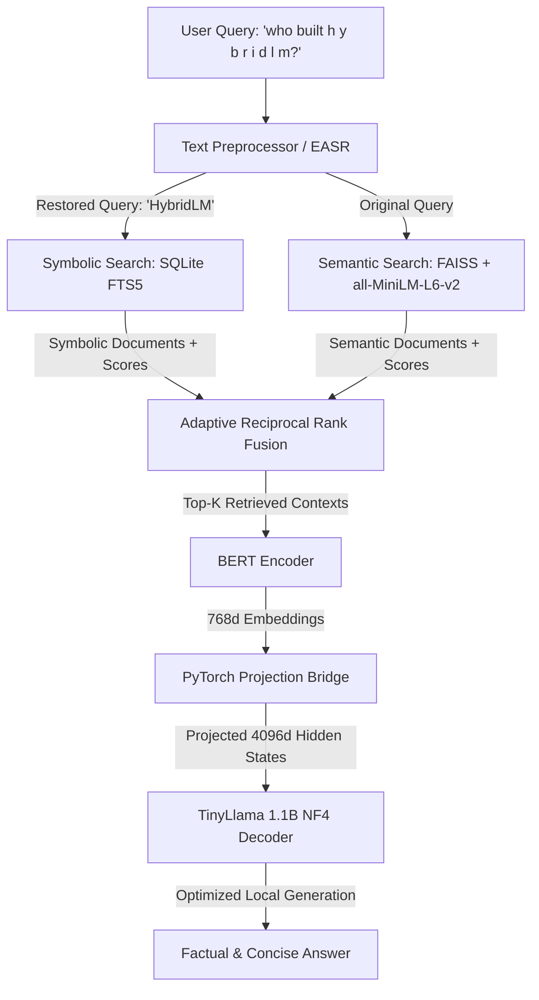

# 🧠 HybridLM: Memory-Optimized Neuro-Symbolic Hybrid RAG System

[](https://www.python.org/)
[](https://pytorch.org/)
[](https://huggingface.co/)
[](https://github.com/facebookresearch/faiss)
[](https://www.sqlite.org/)
[](https://github.com/TimDettmers/bitsandbytes)

**HybridLM** is an edge-optimized, production-grade **Neuro-Symbolic Retrieval-Augmented Generation (RAG)** system designed to run locally on consumer hardware (specifically targeting **8GB GPU** limits, such as NVIDIA RTX 4060). 

It fuses the cognitive, semantic strengths of **Dense Vector Retrieval (FAISS)** with the rigid, factually correct logic of **FTS5 Symbolic Relational Search (SQLite)** using a dynamic, adaptive weighting algorithm and Reciprocal Rank Fusion (RRF).


## 🏗️ Architecture & System Flow



### 1. The Neuro-Symbolic Hybrid Retrieval Engine
* **Symbolic Search:** Employs **SQLite FTS5** for keyword, exact, and relational database matching. Ideal for entities, serial numbers, dates, and rigid factual queries.
* **Semantic Search:** Uses **FAISS** (`faiss.IndexFlatIP` Inner Product) computing cosine similarity on normalized embeddings generated by the `all-MiniLM-L6-v2` transformer. Ideal for high-level conceptual, descriptive, and fuzzy queries.
* **Text Preprocessor & EASR (Entity Alignment & Symbolic Restoration):** Resolves OCR errors, spacing, and casing (e.g. converting spaced words like `"h y b r i d l m"` to `"HybridLM"`), which is critical for making database indexing and symbolic lookups succeed.
* **Adaptive Weighting:** Analyzes the query syntax (entities, temporal cues, semantic/factual indicators) to dynamically adjust the retrieval weights ($\alpha$ for symbolic, $\beta$ for semantic) before fusing results.

### 2. PyTorch Representation Projection Bridge
To bridge the gap between the compact query encoder (768-dimensional hidden states) and the large decoder representation space (e.g., LLaMA's 4096-dimensional space), HybridLM implements custom PyTorch projection layers:

$$\mathbf{H}_{\text{projected}} = \text{LayerNorm}(\mathbf{H}_{\text{encoder}} \mathbf{W}_{p} + \mathbf{b}_{p}) \cdot \text{GELU}(\mathbf{x})$$

The projection bridge maps the semantic hidden state vector of BERT to the latent space of the causal language model, preserving local manifold structure while matching target dimensions.

### 3. Edge GPU Memory Optimization Strategy
To enable full local execution on **8GB VRAM consumer GPUs**, HybridLM implements a strict memory scheduling protocol:
* **Lazy Loading:** Language decoder model is only loaded into GPU memory when generation is actively triggered.
* **Encoder Offloading:** The BERT embedding encoder is offloaded back to the host CPU immediately after vector encoding.
* **Aggressive Garbage Collection:** Forces PyTorch cache clearing (`torch.cuda.empty_cache()`) and garbage collection (`gc.collect()`) after every generation loop.
* **Double Quantization (NF4):** Quantizes the causal LLM decoder using `bitsandbytes` 4-bit NormalFloat (NF4) with double quantization, reducing the decoder VRAM footprint by 75% without compromising generation coherence.

---

## 📁 Repository Structure

```text
LLM/
├── images/
│   └── hybrid_lm_architecture.png # Conceptual architecture system card
├── modules/
│   ├── __init__.py
│   ├── bridge.py                  # PyTorch 768d -> 4096d Linear Projection Bridge
│   ├── preprocess.py              # Text Preprocessor & EASR Entity Alignment
│   ├── semantic_retriever.py      # FAISS Embedding Retrieval
│   ├── symbolic_retriever.py      # SQLite Full-Text Search Retrieval
│   ├── fusion_retriever.py        # Adaptive α/β Fusion Retrieval Engine
│   └── hybrid_model_optimized.py  # Lazy loading, 4-bit quantized local LLM execution
├── test scripts/
│   ├── nlp_sanity_check.py        # NLP Preprocessing & EASR Tests
│   ├── rag_sanity_check.py        # FAISS & FTS5 Search Verification
│   ├── RAG.ipynb                  # Retrieval interactive notebook
│   └── hybridlm_core_integration.ipynb # End-to-end integration demo
├── requirements.txt               # Dependencies listing
└── symbolic_rag.db                # SQLite database with FTS5 virtual tables
```

---

## ⚡ Quickstart Guide

### 1. Clone & Navigate
```bash
git clone https://github.com/VedhSontha/HybridLM.git
cd HybridLM
```

### 2. Install Dependencies
```bash
pip install -r requirements.txt
```

> [!NOTE]
> This system has been verified and optimized for consumer GPUs like the **NVIDIA RTX 4060 (8GB VRAM)** running on local CUDA environments.

### 2. Run Sanity Checks
Ensure the preprocessors and databases are functioning correctly:
```bash
python "test scripts/nlp_sanity_check.py"
python "test scripts/rag_sanity_check.py"
```

### 3. Run the E2E Hybrid Model
Launch the memory-optimized end-to-end question answering loop:
```python
from modules.hybrid_model_optimized import HybridLMOptimized
from modules.fusion_retriever import hybrid_search

# Initialize optimized hybrid model
model = HybridLMOptimized(
    encoder_name="bert-base-uncased",
    decoder_name="TinyLlama/TinyLlama-1.1B-Chat-v1.0",
    use_4bit=True
)

# Run Query Search & Generation
query = "Who built h y b r i d l m?"
retrieved = hybrid_search(query, top_k=3, verbose=True)
answer = model.generate(query, retrieved, max_new_tokens=150)

print(f"Answer: {answer}")
```
